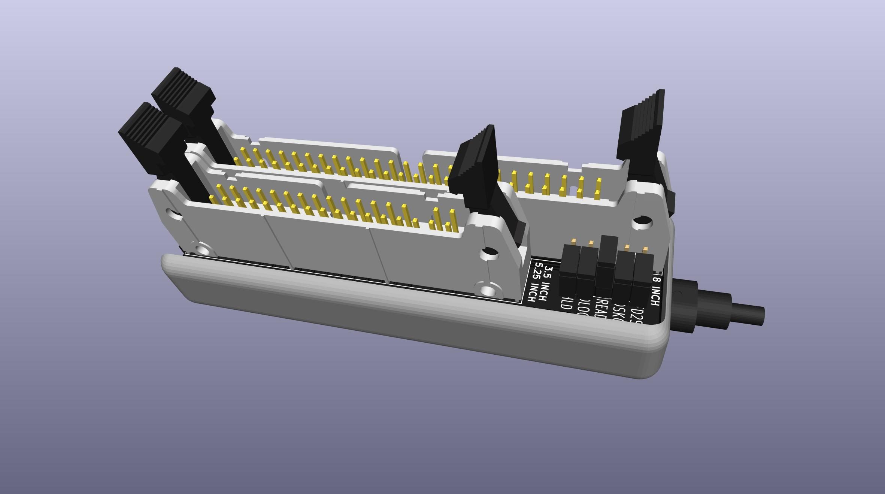
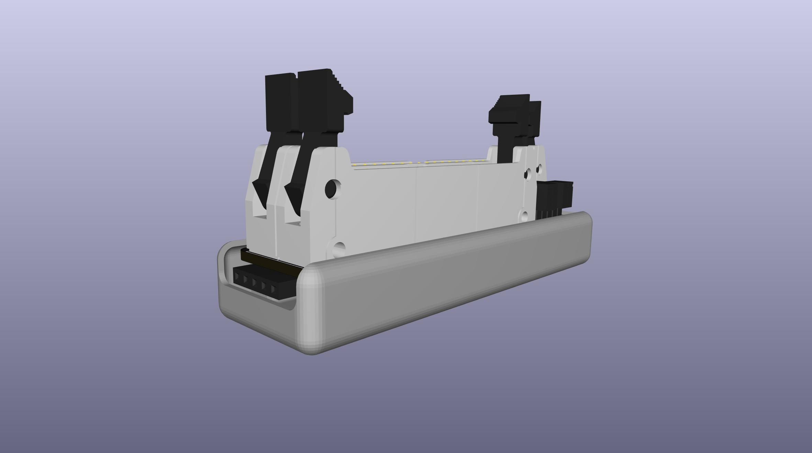
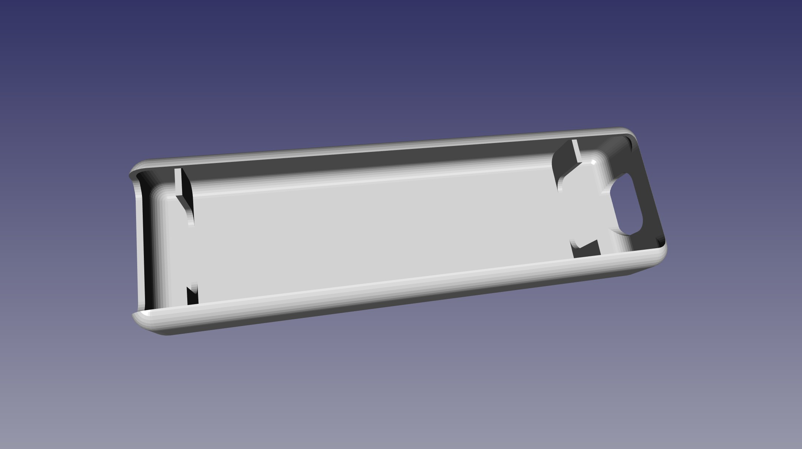

# FluxEngine Kit

This is an adapter PCB and printable snap cover to build a nice version of [FluxEngine](http://cowlark.com/fluxengine/)

I am not the creator of FluxEngine itself, just this connector PCB and printable cover.

Most people probably do not need this pcb. It's really just to provide convenient support for 8-inch drives.

If you don't need to support 8-inch drives, then you don't need any adapter pcb like this.  
The FluxEngine pinout is already designed so that you can just solder a 34-pin connector directly to the CY8CKIT-059 fpga board.  
You could skip the pcb and the printed cover, use the same BOM link below and remove the 50-pin connector and pin headers, and just keep the fpga board and the 34-pin connector.

## PARTS
[BOM from DigiKey](https://www.digikey.com/short/r214w4b0)  
[PCB and Cover from PCBWAY](https://www.pcbway.com/project/shareproject/FluxEngine_Hat_e3000eb5.html)

If you don't already have a convenient way to power the floppy drive(s) externally:  
[Molex power supply](https://amazon.com/dp/B000MGG6SC)  
[Molex to Berg splitter](https://amazon.com/dp/B0002J1KW6)  
[Molex to Molex splitter](https://amazon.com/dp/B00007JO36)  
[Floppy drive cable](https://amazon.com/dp/B07KDJTMGP)  

## Enclosure

There is a printable [cover](CASE/out/FluxEngine_Case.stl) in the CASE directory, designed in OpenSCAD.

## Fabrication

The cover prints easily with any common FDM printer with PLA.

The PCBWAY link above provides both the PCB and the cover if you want. The buy link to the right is for the pcb, to get the cover scroll down the page to the FluxEngine_Case.stl file and it also has a buy link.

You can also get both the pcb and the cover at the same time on the same order from Elecrow for about $13 including shipping.  
Get the gerber.zip and STL from [releases](../../releases).
Choose high strength nylon for the 3d printing to get a strong black part.
