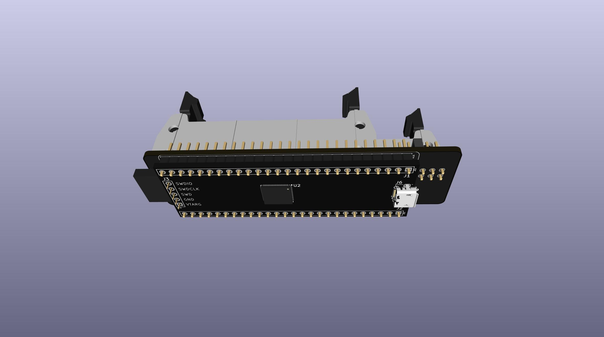
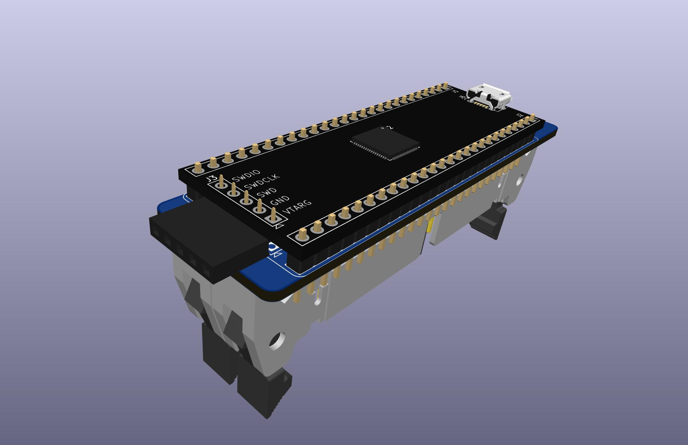
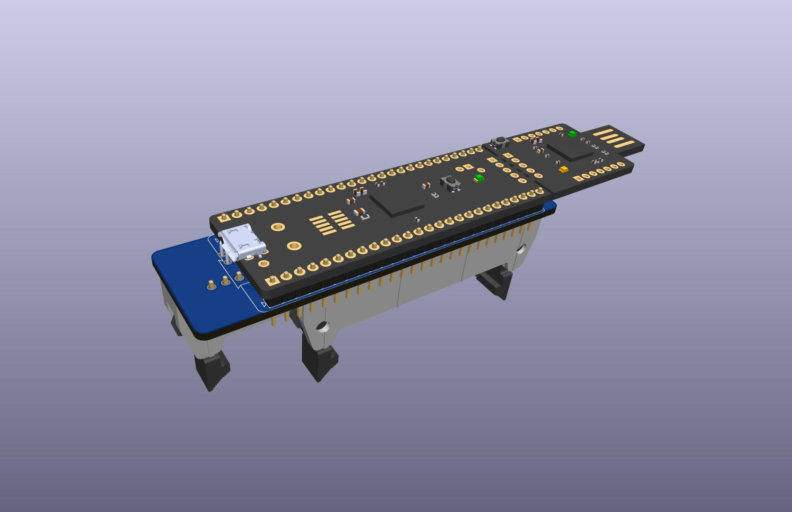
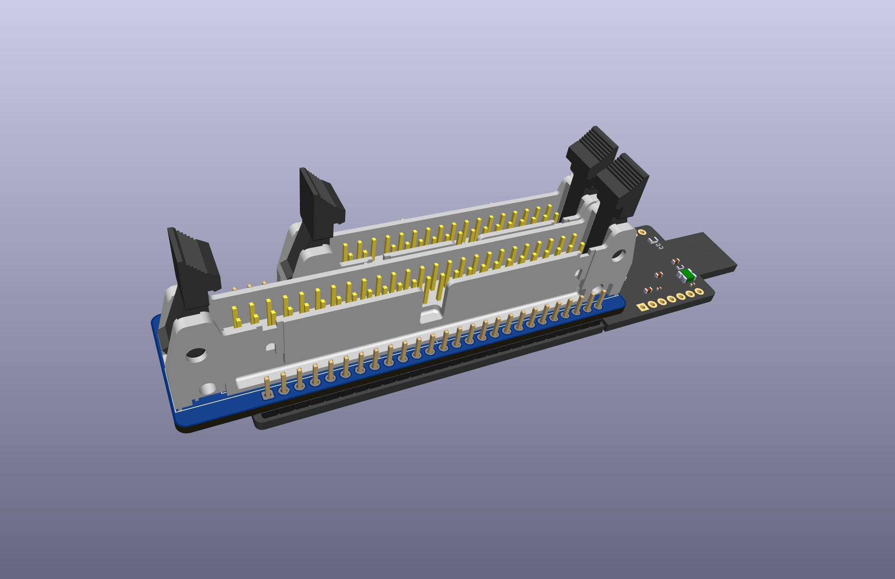
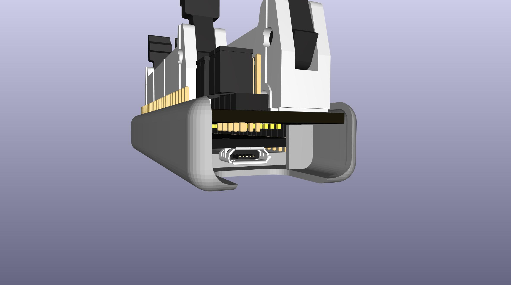
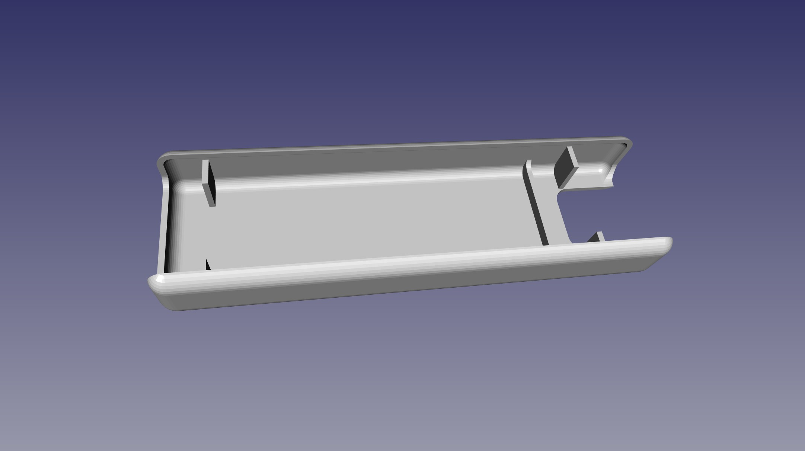

# FluxEngine Kit

This is a sort of kit of the pieces to assemble a [FluxEngine](http://cowlark.com/fluxengine/)

I am not the creator of FluxEngine itself, this is just an adapter PCB and a 3d-printable snap cover shell, and some directions and links to parts to buy all the parts to build a FluxEngine.

This PCB isn't needed for the most common use-case.  
The most practical way to assemble a FluxEngine is to just solder the even row of the 34-pin connector directly to J1 pins 8-24 on the top side of the fpga board.  
Before soldering, pull out pin 5 and discard it. After soldering, solder a 3 inch long bare wire to J1 pin 25 labelled GND, then lay that along the odd row pins of the connector and solder the wire to all the odd row pins.  
That's it. That's a complete FluxEngine ready to go for 99% of use cases with typical 3.5 and 5.25 inch floppy drives.

This PCB is just to supply both 34 and 50 pin connectors to add support for 8-inch drives also.

It also allows to make the floppy connectors removable with pin headers and sockets, so you can still use the fpga board for other things instead of soldering a connector permanently to it.  
Just solder male pins to the bottom of the fpga board the same way you would any other mcu dev board so that you can plug the fpga board into a bread board with the usb and button facing up.  
And solder pin sockets to the Hat on the side opposite the connectors.  
Now the fpga board can be used as a FluxEngine or used for something else by just unplugging it.

## PARTS
[BOM from DigiKey](https://www.digikey.com/short/r214w4b0)  

If you don't already have a convenient way to power the floppy drive(s):  
[Molex power supply](https://amazon.com/dp/B000MGG6SC)  
[Molex to Berg splitter](https://amazon.com/dp/B0002J1KW6)  
[Molex to Molex splitter](https://amazon.com/dp/B00007JO36)  
[Floppy drive cable](https://amazon.com/dp/B07KDJTMGP)  

## Enclosure

There is a simple snap on cover in the CASE directory.

## FAB

The cover is easily printable with a common home fdm printer.

But you can get also both the pcb and the cover at the same time on the same order from Elecrow for about $13 including shipping. Choose nylon or high strength nylon for the 3d printing.
