# FluxEngine Kit

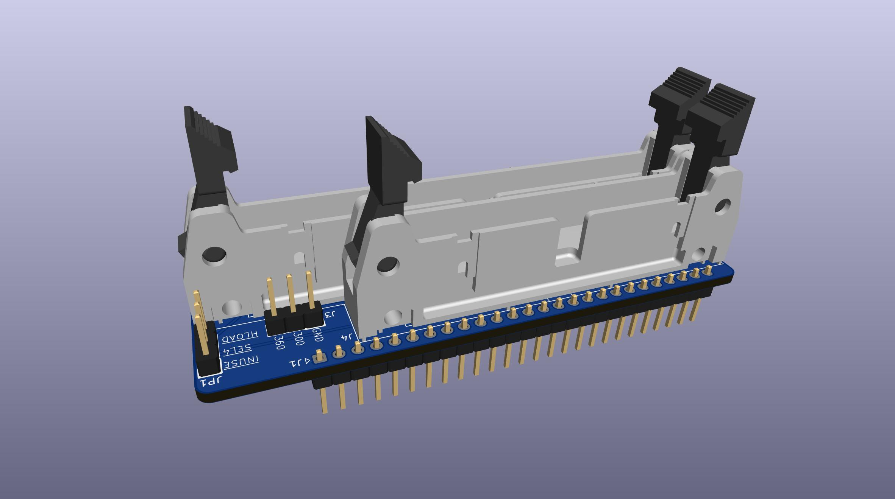
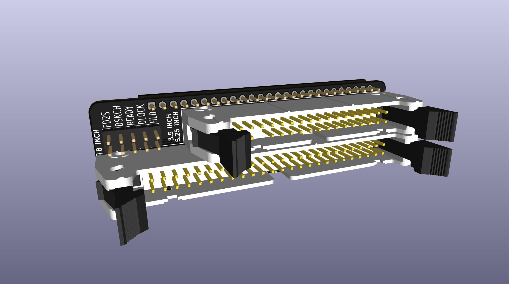
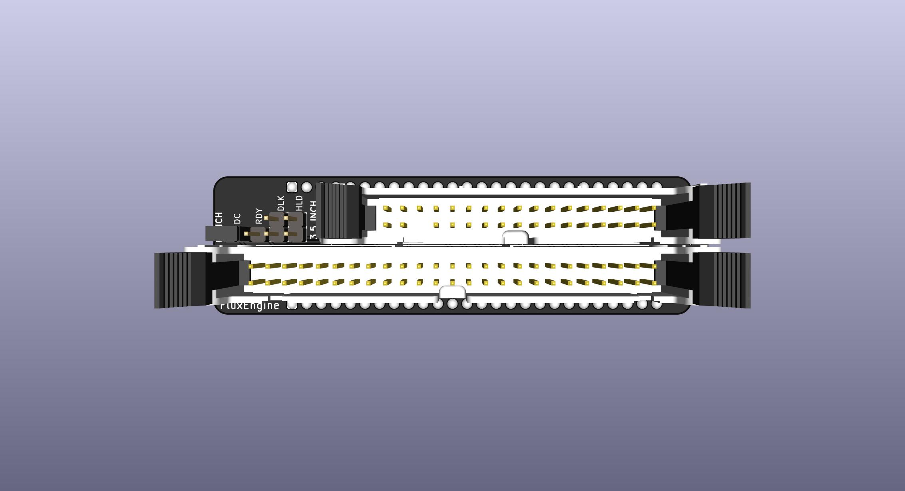
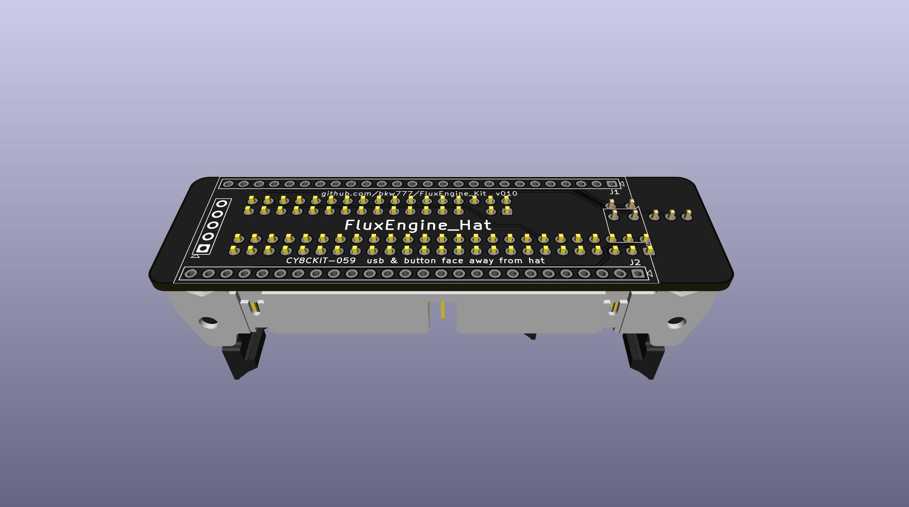
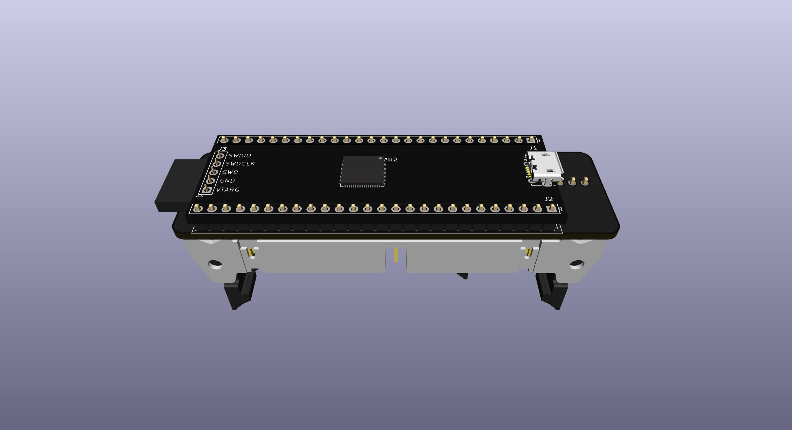
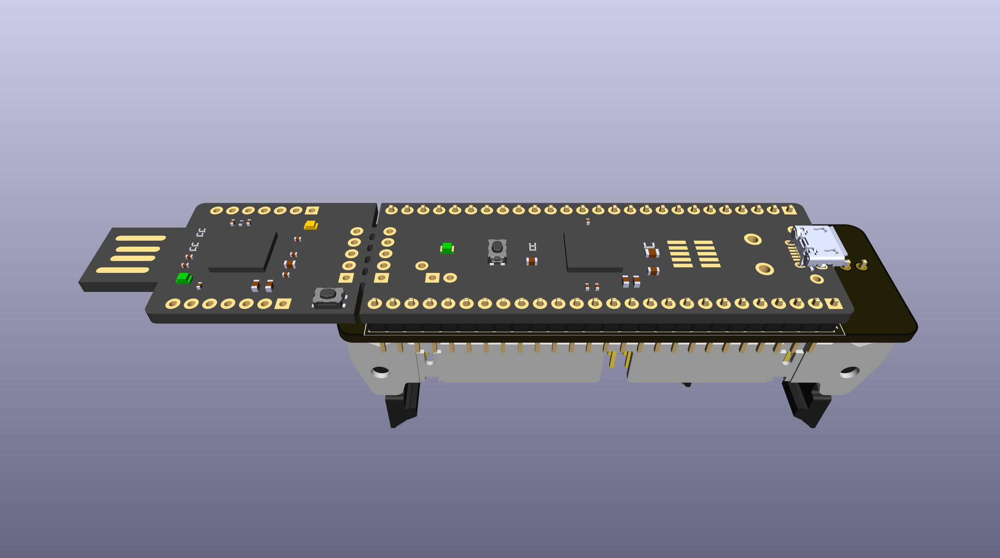
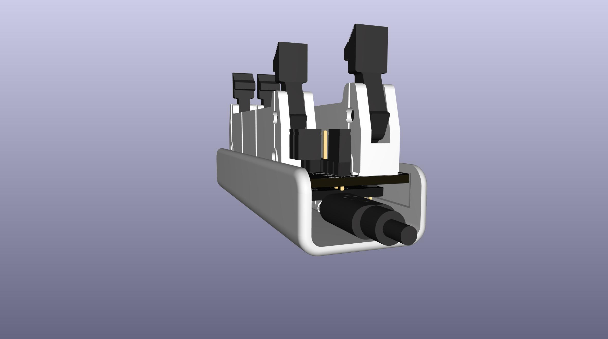
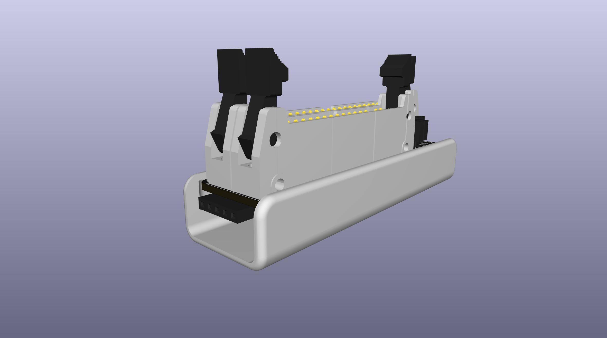
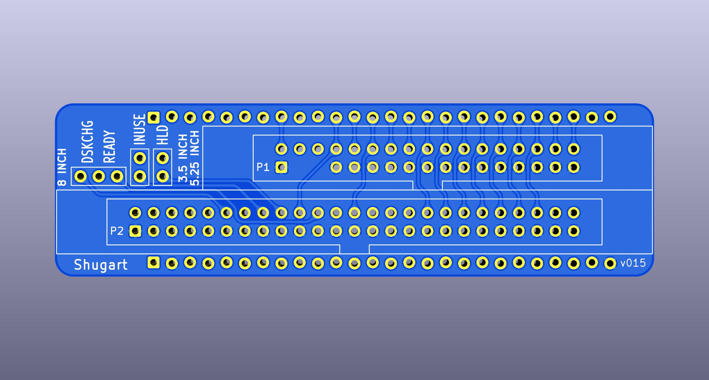
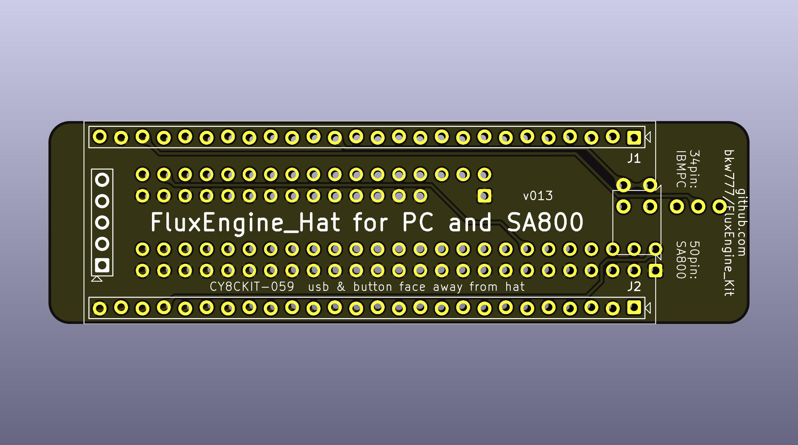
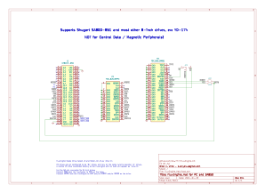

These PCBs ARE NOT TESTED YET.

This is an adapter PCB and printable snap cover to build a nice version of [FluxEngine](http://cowlark.com/fluxengine/)

I am not the creator of FluxEngine itself, just this connector PCB and printable cover.

Most people probably do not need this pcb. It's really just to provide convenient support for 8-inch drives.

If you don't need to support 8-inch drives, then you don't need any adapter pcb like this.  
The FluxEngine pinout is already designed so that you can just solder a 34-pin connector directly to the CY8CKIT-059 fpga board.  
You could just use the BOM link below and delete everything but the CY8CKIT-059 and the 34-pin connector, no pcb, no printed cover.

## PARTS
[BOM from DigiKey](https://www.digikey.com/short/q5zh79n9)  
[PCB and Cover from PCBWAY](https://www.pcbway.com/project/shareproject/FluxEngine_Hat_e3000eb5.html)

If you don't already have a convenient way to power the floppy drive(s) externally:  
[Molex power supply](https://amazon.com/dp/B000MGG6SC)  
[Molex to Berg splitter](https://amazon.com/dp/B0002J1KW6)  
[Molex to Molex splitter](https://amazon.com/dp/B00007JO36)  
[Floppy drive cable](https://amazon.com/dp/B07KDJTMGP)  

## Enclosure

There are several versions of printable cover in the CASE directory.

[FluxEngine_FancyCover.stl](CASE/out/FluxEngine_FancyCover.stl)

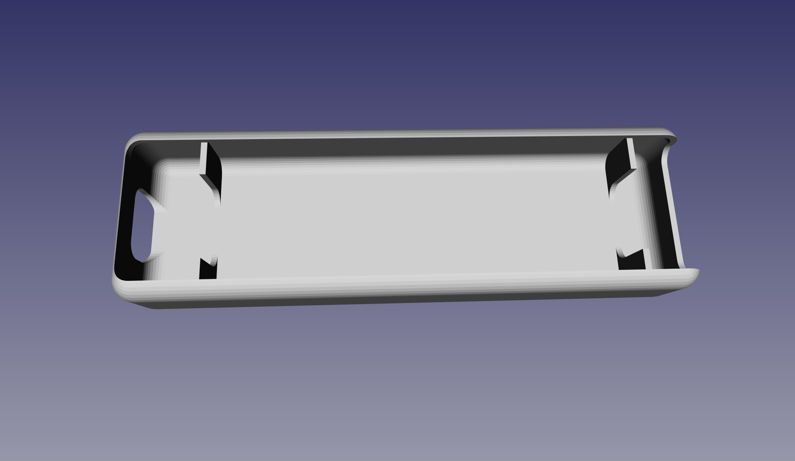

[FluxEngine_SimpleCover.stl](CASE/out/FluxEngine_SimpleCover.stl) - soldered and flush-cut pins  
[FluxEngine_SimpleCover_solderless.stl](CASE/out/FluxEngine_SimpleCover_solderless.stl) - dry-fit full length pins   
[FluxEngine_SimpleCover_sockets.stl](CASE/out/FluxEngine_SimpleCover_sockets.stl) - square pin sockets  

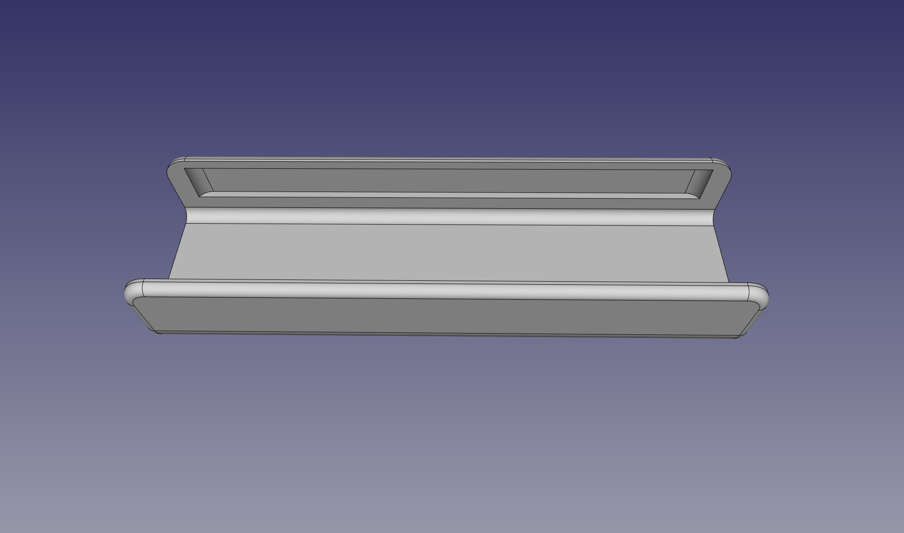  
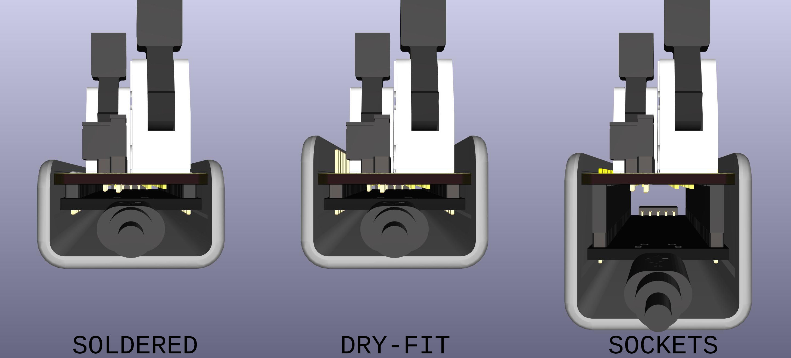

## Fabrication

The cover prints easily with any common FDM printer with PLA.

The PCBWAY link above can provide both the PCB and the cover. The buy link to the right is for the pcb. To get the cover scroll down the page to the FluxEngine_Case.stl file and it has it's own buy link.

You can also get both the pcb and the cover at the same time on the same order from Elecrow for about $13 including shipping.  
Get the gerber.zip and STL from [releases](../../releases).
Choose high strength nylon for the 3d printing to get a strong black part.

## Configuration

The jumpers only affect the 50-pin connector for 8-inch drives.  

### DC / RDY
Connects either /DSKCHG or /READY output from the drive to the /DSKCHG input on the host.  

Install jumper on DC by default.

### DLK / HLD
Connects the /MOTA (motor-A-on) output from the host to either the /DOOR-LOCK aka /IN-USE or /HEAD-LOAD input on the drive, or neither, or both.

Usually not needed, but if needed, you may need one or the other or both.

Don't short either position by default, but do stow two inactive jumpers.

# Control Data / Magnetic Peripherals 8-inch drives
CDC drives have several different pinouts and they are nothing like the Shugart SA800 pinout.  
There are special hat versions just for CDC/MPI drives.  
Currently there are 2 CDC hats for CDC 9406 drives.  
On page 5-4 in the [CDC 9406 manual](PCB/datasheets/77614903AM_9406_Flexible_Disk_Description_Jun82.pdf) there are 4 columns showing 4 different drive pinouts. columns 2, 3, & 4 are all the same for all the pins that matter, and column 1 is very different.  

* "FluxEngine_Hat for CDC 9406 cfg 1" is for column 1  
* "FluxEngine_Hat for CDC 9406 cfg 2" is for columns 2, 3, & 4

THESE ARE NOT TESTED YET  
I have a BR8A8A aka 77618019 drive on the way. That will be a test of the "CDC 9406 cfg 2" hat.

