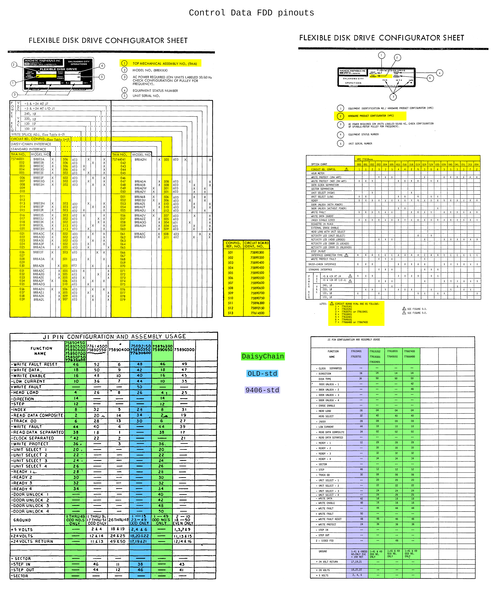

# FluxEngine Kit

THESE PCBs ARE NOT TESTED YET

This is a set of adapter PCBs and printable snap covers to build a nice version of [FluxEngine](http://cowlark.com/fluxengine/)

I am not the creator of FluxEngine itself, just this adapter PCB and printable cover.

Most people probably do not need any of these pcbs. They are really just to provide convenient support for 8-inch drives.

If you're not trying to use 8-inch drives, then you don't need any adapter pcb like this.  
The FluxEngine pinout is already designed so that you can just solder a 34-pin connector directly to the CY8CKIT-059 fpga board.  
You can use the BOM link below and delete everything but the CY8CKIT-059 and the 34-pin connector, no pcb, no printed cover.

## Parts
[BOM from DigiKey](https://www.digikey.com/short/q5zh79n9)  
[PCB and Cover from PCBWAY](https://www.pcbway.com/project/shareproject/FluxEngine_Hat_e3000eb5.html)

If you don't already have a convenient way to power the floppy drive(s) externally:  
[Molex power supply](https://amazon.com/dp/B000MGG6SC)  
[Molex to Berg splitter](https://amazon.com/dp/B0002J1KW6)  
[Molex to Molex splitter](https://amazon.com/dp/B00007JO36)  
[Floppy drive cable](https://amazon.com/dp/B07KDJTMGP)  

## Cover

There are several versions of printable cover in the CASE directory.

[FluxEngine_FancyCover.stl](CASE/out/FluxEngine_FancyCover.stl)

[FluxEngine_SimpleCover.stl](CASE/out/FluxEngine_SimpleCover.stl) - soldered and flush-cut pins  
[FluxEngine_SimpleCover_solderless.stl](CASE/out/FluxEngine_SimpleCover_solderless.stl) - dry-fit full length pins   
[FluxEngine_SimpleCover_sockets.stl](CASE/out/FluxEngine_SimpleCover_sockets.stl) - square pin sockets  

  

## Fabrication

The cover prints easily with any common FDM printer with PLA.

The PCBWAY link above can provide both the PCB and the cover. The buy link to the right is for the pcb. To get the cover scroll down the page to the STL file and it has it's own buy link.

You can also get both the pcb and the cover at the same time on the same order from Elecrow for about $13 including shipping.  
Get the gerber.zip and STL from [releases](../../releases).
Choose high strength nylon for the 3d printing to get a strong black part. It doesn't really need the strength of nylon, but resin will probably be too fragile.

## Configuration

The jumpers only affect the 50-pin connector for 8-inch drives.  

### DC / RDY
Connects either /DSKCHG or /READY output from the drive to the /DSKCHG input on the host.  

Install jumper on DC by default.

### DLK / HLD
Connects the /MOTB (motor-B-on) output from the host to either the /DOOR-LOCK aka /IN-USE, or /HEAD-LOAD input on the drive, or neither, or both.

Usually not needed, but if needed, you may need one or the other or both.

Don't short either position by default, but do stow two inactive jumpers.

# Control Data / Magnetic Peripherals / Honeywell 8-inch drives

Some CDC drives like the 9404 line are Shugart compatible, and so for those just use the SA850 hat like any other Shugart bus drive (jumpers on HLD and RDY in that case)

But many (most?) CDC drives had totally different pinouts and interfaces, not remotely Shugart compatible.  
There were several different interfaces and configurations, but of those, it does appear that most drives probably fall into one of two possible pinouts.

The two tables below come from two CDC manuals covering many similar drive models spanning several years.  
Left: [CDC FDD FSM ('79)](PCB/datasheets/CDC_77834769_Y__FDD_FSM.pdf)  
Right: [CDC 9406 FSM ('82)](PCB/datasheets/CDC_77614903_AM__9406_FSM.pdf)  

There are special hats for the most common CDC pinouts.

The "CDC DaisyChain" hat supports all the green highlighted models.

The "CDC 9406-std" hat supports the purple highlighted models.

The "CDC OLD-std" hat supports the blue highlighted models.

The 9406-std and OLD-std are actually the same except that the old interface had STEP_IN/STEP_OUT instead of STEP+DIRECTION.  
So the OLD-std hat is just a copy of the 9406-std hat, with a quad-nand added to convert STEP+DIRECTION from the FluxEngine to STEP_IN/STEP_OUT for the drive.

THESE ARE NOT TESTED YET  
I have a 77618019 drive which will be a test of the standard CDC hat.

There's no BOM specifically for the CDC hats  
The DaisyChain hat doesn't need anything else.  

Here's the pulggable 4-pin screw terminal for drives that get power from the I/O cable:  
https://www.digikey.com/en/products/detail/phoenix-contact/5452094/5186805 header  
https://www.digikey.com/en/products/detail/phoenix-contact/5452178/5187210 plug

And the chip & decoupling cap for the OLD-std hat:  
https://www.digikey.com/en/products/detail/texas-instruments/SN74HC00PWR/377066  
https://www.digikey.com/en/products/detail/kyocera-avx/KGM21NR71E104KT/1116281

### More 8-inch info

The AC & DC power connectors were the same on many drives.  
These are the cable-side connector housings and female pins needed to make proper cables to connect to most drives.

3-pin AC power:  
Housing: [AMP/TE 1-480700-0](https://www.digikey.com/en/products/detail/te-connectivity-amp-connectors/1-480700-0/29339)  
Female pins: [AMP/TE 350536-1](https://www.digikey.com/en/products/detail/te-connectivity-amp-connectors/350536-1/287712)

6-pin DC power:  
Housing: [AMP/TE 1-480270-0](https://www.digikey.com/en/products/detail/te-connectivity-amp-connectors/1-480270-0/15668)  
Female pins: [AMP/TE 61117-1](https://www.digikey.com/en/products/detail/te-connectivity-amp-connectors/61117-1/290254)

They do make dual-output power supplies that output both 5v and 24v, but it's actually cheaper to buy seperate supplies.  
A typical drive draws about 1.0A-1.5A from either DC rails while working.  
Here are a couple of supplies just for convenience & reference:  
[5V 3A Meanwell](https://www.digikey.com/en/products/detail/mean-well-usa-inc/RS-15-5/7706168)  
[24V 3.2A Meanwell](https://www.digikey.com/en/products/detail/mean-well-usa-inc/RS-15-5/7706168)

### Probably CDC-specific

The CDC manuals do not say this anywhere, but many drives have a variant of the 50-pin connector with two polarity keys instead of one in the center. The drawings and actual part numbers in the service manuals only show the normal single-notch type.  
A normal plug with polarity key does not fit. Non-polarized plugs fit, but here are a couple of fully polarity-keyed female IDC plugs that fit:  
[Omron XG4M-5031-T](https://www.digikey.com/en/products/detail/omron-electronics-inc-emc-div/XG4M-5031-T/1829402)  
[Hirose HIF3BA-50D-2.54R](https://www.digikey.com/en/products/detail/hirose-electric-co-ltd/HIF3BA-50D-2-54R-63/12758574)

Connector housing & contacts to fit the 7-pin power connection on CDC drives.  
The pins are .156" pitch which is not uncommon, but a .031"x.062" flat blade shape not square, so the "AMPMODU MOD I" is important here, as is specifically the high-pressure version of the pin receptacle.  
Only 4 pins are connected, so you could uses as little as a 5-position housing, but ideally you still want a housing with 7 or more positions and receptacles installed for all 6 pins, because the extra 2 n/c pins provide extra retension friction and strain relief.  
[TE 87159-7 - AMPMODU MOD I receptacle housing, 7-pin non-locking keyed](https://www.mouser.com/ProductDetail/TE-Connectivity-AMP/87159-7)  
[TE 102100-2 - AMPMODU MOD I pin receptacle, non-locking high-pressure 18-22awg gold-30uin](https://www.mouser.com/ProductDetail/TE-Connectivity/102100-2) (need 6)  
[TE 87116-2 - AMPMODU MOD I keying plug](https://us.rs-online.com/product/te-connectivity/87116-2/70287356/) (need 1)  
