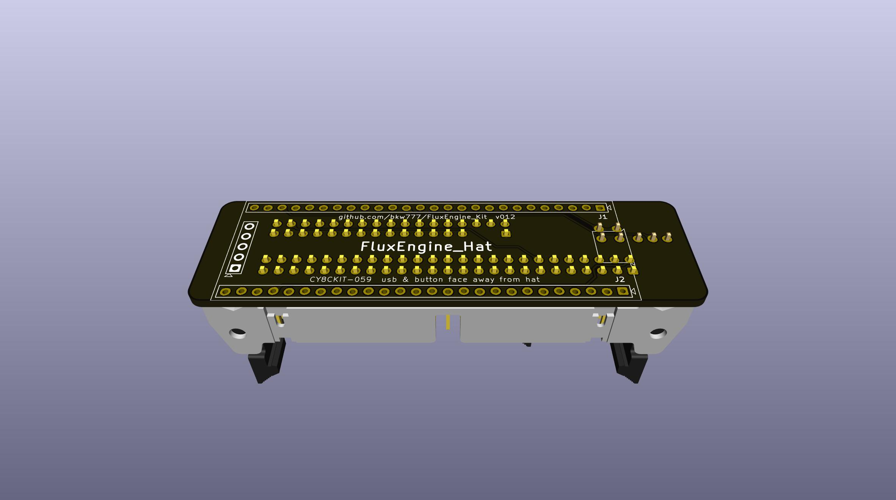

# FluxEngine Kit

These PCBs ARE NOT TESTED YET.

This is an adapter PCB and printable snap cover to build a nice version of [FluxEngine](http://cowlark.com/fluxengine/)

I am not the creator of FluxEngine itself, just this connector PCB and printable cover.

Most people probably do not need this pcb. It's really just to provide convenient support for 8-inch drives.

If you don't need to support 8-inch drives, then you don't need any adapter pcb like this.  
The FluxEngine pinout is already designed so that you can just solder a 34-pin connector directly to the CY8CKIT-059 fpga board.  
You could just use the BOM link below and delete everything but the CY8CKIT-059 and the 34-pin connector, no pcb, no printed cover.

## PARTS
[BOM from DigiKey](https://www.digikey.com/short/q5zh79n9)  
[PCB and Cover from PCBWAY](https://www.pcbway.com/project/shareproject/FluxEngine_Hat_e3000eb5.html)

If you don't already have a convenient way to power the floppy drive(s) externally:  
[Molex power supply](https://amazon.com/dp/B000MGG6SC)  
[Molex to Berg splitter](https://amazon.com/dp/B0002J1KW6)  
[Molex to Molex splitter](https://amazon.com/dp/B00007JO36)  
[Floppy drive cable](https://amazon.com/dp/B07KDJTMGP)  

## Enclosure

There are several versions of printable cover in the CASE directory.

[FluxEngine_FancyCover.stl](CASE/out/FluxEngine_FancyCover.stl)

[FluxEngine_SimpleCover.stl](CASE/out/FluxEngine_SimpleCover.stl) - soldered and flush-cut pins  
[FluxEngine_SimpleCover_solderless.stl](CASE/out/FluxEngine_SimpleCover_solderless.stl) - dry-fit full length pins   
[FluxEngine_SimpleCover_sockets.stl](CASE/out/FluxEngine_SimpleCover_sockets.stl) - square pin sockets  

  

## Fabrication

The cover prints easily with any common FDM printer with PLA.

The PCBWAY link above can provide both the PCB and the cover. The buy link to the right is for the pcb. To get the cover scroll down the page to the FluxEngine_Case.stl file and it has it's own buy link.

You can also get both the pcb and the cover at the same time on the same order from Elecrow for about $13 including shipping.  
Get the gerber.zip and STL from [releases](../../releases).
Choose high strength nylon for the 3d printing to get a strong black part.

## Configuration

The jumpers only affect the 50-pin connector for 8-inch drives.  

### DC / RDY
Connects either /DSKCHG or /READY output from the drive to the /DSKCHG input on the host.  

Install jumper on DC by default.

### DLK / HLD
Connects the /MOTA (motor-A-on) output from the host to either the /DOOR-LOCK aka /IN-USE or /HEAD-LOAD input on the drive, or neither, or both.

Usually not needed, but if needed, you may need one or the other or both.

Don't short either position by default, but do stow two inactive jumpers.

# Control Data / Magnetic Peripherals 8-inch drives

CDC/MPI drives seem to have been pretty common, but have a totally different pinout than Shugart. They actually have several different pinouts and some are completely custom and incompatible, but one of the pinouts, with only a pin or 2 two different but no pins we care about, seems to be used by most models. So I'll call that pinout "CDC standard".

The two tables below come from two CDC manuals covering many similar drive models.  
Left: [CDC FDD FSM ('79)](PCB/datasheets/CDC_77834769_Y__FDD_FSM.pdf)  
Right: [CDC 9406 FSM ('82)](PCB/datasheets/CDC_77614903_AM__9406_FSM.pdf)  

There is a hat version for "CDC STD" which matches all the green highlighted drives, and (I'm guessing) probably covers most CDC/MPI drives.

There is also a hat version for "CDC ALT1", the purple highlight, simply because at least that pinout has the necessary signals that it's possible.  
I have no idea if those models are common, or if the power really needs to be on the data cable or if the drives still have a simple way to provide the DC power directly. The hat includes the power connections simply because it was possible without even increasing the size of the pcb. The drive draws less than 1.5A on either rail, and both the screw terminals and the traces are good for over 5A. So although I don't really *recommend* powering a drive that way if there is any other option, it should be fully safe to do so.

One of the other pinouts, the 4th column on the left table, under 75892150, is almost identical to "ALT1" with the only differences being it has STEP_IN + STEP_OUT instead of STEP + DIRECTION, but using the same 2 pins, and there is no READY signal. So maybe those drives could eventually be supported also by the same ALT1 hat with only software or firmware changes. Worst case I could probably add a tiny bit of logic to the board (probably a few gates in a single 74xx series) to optionally convert the STEP signals. I don't know about the lack of READY though.

THESE ARE NOT TESTED YET  
I have a BR8A8A aka 77618019 drive on the way. That will be a test of the "CDC standard" hat.

