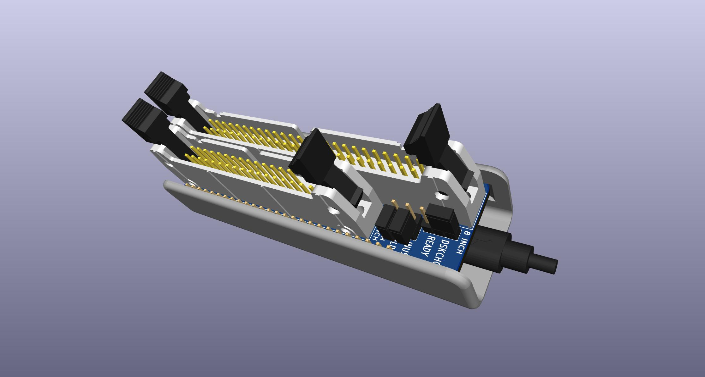

# FluxEngine Kit

All of the pieces to assemble a [FluxEngine](http://cowlark.com/fluxengine/)

I am not the creator of FluxEngine, this is just an adapter PCB, eventually a 3d-printable case, and some directions and links to parts to build a FluxEngine.

The PCB is based on the [user-submitted PCB](http://cowlark.com/fluxengine/doc/building.html#if-you-want-to-use-a-pcb) on the FluxEngine site.

Differences:  
* Re-drawn in KiCAD instead of Eagle.
* J1 9,10 NC
* 34-pin 3,4,5,6 NC
* 34-pin physically remove pin 5

## PARTS
[DigiKey BOM with all parts](https://www.digikey.com/short/zb23f8pq)  
BOM includes the fpga board and a usb cable.
<!--
1 x [CY8CKIT-059 fpga dev board](https://www.digikey.com/en/products/detail/infineon-technologies/CY8CKIT-059/5184557)  
1 x [34-pin male latching box header](https://www.digikey.com/en/products/detail/amphenol-cs-fci/86130342114345E1LF/5201658)  
1 x [50-pin male latching box header](https://www.digikey.com/en/products/detail/amphenol-cs-fci/86130502114345E1LF/5201692)  
2 x [1x40 male pin header](https://www.digikey.com/en/products/detail/sullins-connector-solutions/PRPC040SAAN-RC/2775214)  
2 x [1x40 female pin header](https://www.digikey.com/en/products/detail/chip-quik-inc/HDR100IMP40F-G-V-TH/5978200)  
1 x [male-male dupont jumper wires](https://www.digikey.com/en/products/detail/sparkfun-electronics/PRT-12795/5993860)  
1 x [microusb cable](https://www.digikey.com/en/products/detail/tripp-lite/U050-006-COIL/6204993)  
-->

If you don't already have a convenient way to power the floppy drive(s):  
[Molex power supply](https://amazon.com/dp/B000MGG6SC)  
[Molex to Berg splitter](https://amazon.com/dp/B0002J1KW6)  
[Molex to Molex splitter](https://amazon.com/dp/B00007JO36)  
[Floppy drive cable](https://amazon.com/dp/B07KDJTMGP)  

## Directions

Pull pin 5 out of the 34-pin connector and discard it.

Cut the 40-pin male & female pin headers down to 26 pins.  
For the female, cut in the middle of the 27th pin and then sand or file the end smooth.

Solder the 34-pin and 50-pin connectors to the top side.

Solder the 26-pin male headers to the bottom side.

Snap the programmer board off of the fpga board and sand the rough edge of both the programmer and the fpga board.

Solder the 26-pin female headers to the top side of the fpga board.

Cut 2 5-pin pieces from the leftover female pin headers.

Solder the 5-pin female strips on the top side of the programmer and the fpga board where the programmer was broken off.

Peel a 5-wire group off of the male-male ribbon cable. This is your programming cable for writing new firmware to the fpga board.

