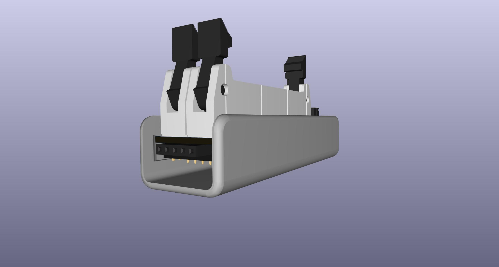
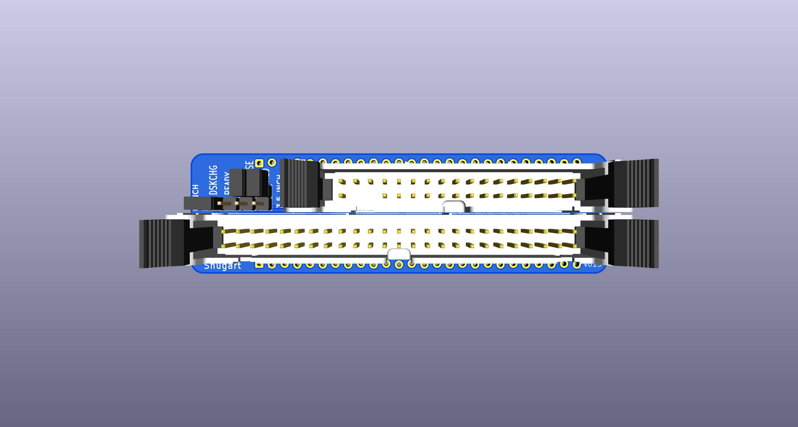
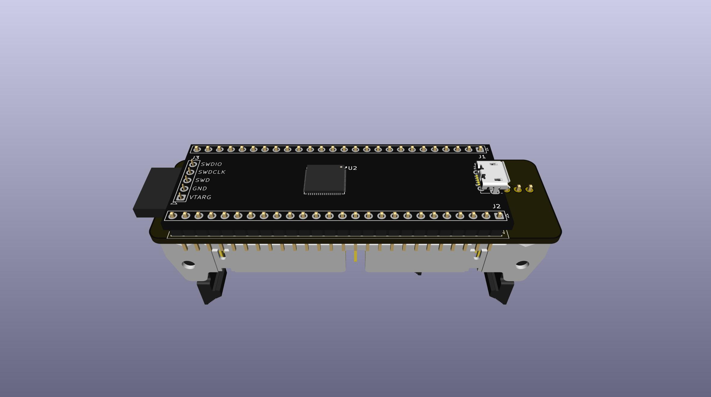
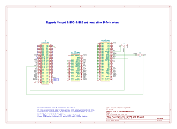

# FluxEngine Kit

THESE PCBs ARE NOT TESTED YET

This is a set of adapter PCBs and printable snap covers to build a nice version of [FluxEngine](http://cowlark.com/fluxengine/)

I am not the creator of FluxEngine itself, just this adapter PCB and printable cover.

Most people probably do not need any of these pcbs. They are really just to provide convenient support for 8-inch drives.

If you're not trying to use 8-inch drives, then you don't need any adapter pcb like this.  
The FluxEngine pinout is already designed so that you can just solder a 34-pin connector directly to the CY8CKIT-059 fpga board.  
You can use the BOM link below and delete everything but the CY8CKIT-059 and the 34-pin connector, no pcb, no printed cover.

## Parts
[BOM from DigiKey](https://www.digikey.com/short/q5zh79n9)  
[PCB and Cover from PCBWAY](https://www.pcbway.com/project/shareproject/FluxEngine_Hat_e3000eb5.html)

If you don't already have a convenient way to power the floppy drive(s) externally:  
[Molex power supply](https://amazon.com/dp/B000MGG6SC)  
[Molex to Berg splitter](https://amazon.com/dp/B0002J1KW6)  
[Molex to Molex splitter](https://amazon.com/dp/B00007JO36)  
[Floppy drive cable](https://amazon.com/dp/B07KDJTMGP)  

## Cover

There are several versions of printable cover in the CASE directory.

[FluxEngine_FancyCover.stl](CASE/out/FluxEngine_FancyCover.stl)

[FluxEngine_SimpleCover.stl](CASE/out/FluxEngine_SimpleCover.stl) - soldered and flush-cut pins  
[FluxEngine_SimpleCover_solderless.stl](CASE/out/FluxEngine_SimpleCover_solderless.stl) - dry-fit full length pins   
[FluxEngine_SimpleCover_sockets.stl](CASE/out/FluxEngine_SimpleCover_sockets.stl) - square pin sockets  

  

## Fabrication

The cover prints easily with any common FDM printer with PLA.

The PCBWAY link above can provide both the PCB and the cover. The buy link to the right is for the pcb. To get the cover scroll down the page to the STL file and it has it's own buy link.

You can also get both the pcb and the cover at the same time on the same order from Elecrow for about $13 including shipping.  
Get the gerber.zip and STL from [releases](../../releases).
Choose high strength nylon for the 3d printing to get a strong black part. It doesn't really need the strength of nylon, but resin will probably be too fragile.

## Configuration

The jumpers only affect the 50-pin connector for 8-inch drives.  

### DC / RDY
Connects either /DSKCHG or /READY output from the drive to the /DSKCHG input on the host.  

Install jumper on DC by default.

### DLK / HLD
Connects the /MOTA (motor-A-on) output from the host to either the /DOOR-LOCK aka /IN-USE or /HEAD-LOAD input on the drive, or neither, or both.

Usually not needed, but if needed, you may need one or the other or both.

Don't short either position by default, but do stow two inactive jumpers.

# Control Data Corporation / Magnetic Peripherals Inc / Honeywell 8-inch drives

Drives from Control Data, Honeywell, and several others were all actually made by [Magnetic Peripherals](https://en.wikipedia.org/wiki/Control_Data_Corporation#Magnetic_Peripherals_Inc.).  
CDC and Honeywell owned MPI, and MPI mostly only sold directly to them, and CDC OEMed the drives out to many others like [Centurion](https://www.youtube.com/watch?v=GmuDJC1gJOo), or my own drive which says "Educational Computer Corp mfg p/n 910033000-009" which is actually a CDC/MPI 77618019.

CDC drives seem to have been pretty common because of the number of computer system manufacturers, integrators, & resellers that all sourced their drives from CDC.

Some CDC drives like the 9404 line are Shugart-compatible. Use the SA850 hat for those.

Other CDC drives (most others?) have several totally different interfaces. There are several different configurations and some are completely custom and incompatible, but two of those pinouts seem to cover most drives.

The manuals do "sort of" have names for these interfaces, one being "daisy chain" and the other being "standard", but while the "daisy chain" label is meaningful in that all the daisy-chain models have a compatible pinout with each other, what the manuals call "standard FDD interface" is actually a range of different and wildly incompatible interfaces.

All in all, it appears that many, perhaps most drives actually have the "daisy chain" interface, and a good number of the others all share a common pinout which doesn't have a distinct name, and then there are several other pinouts that I have no idea how common they actually were. (actually I have no idea how common any of them were)

So for the purposes of having some sort of label to indicate which adapter hat pcb supports which drives, I am calling all of the "daisy chain" compatible pinouts collectively the "CDC" pinout, and what appears to be the next most common non-daisy-chain pinout I'm calling the "CDC ALT1" pinout.

The two tables below come from two CDC manuals covering many similar drive models spanning several years.  
Left: [CDC FDD FSM ('79)](PCB/datasheets/CDC_77834769_Y__FDD_FSM.pdf)  
Right: [CDC 9406 FSM ('82)](PCB/datasheets/CDC_77614903_AM__9406_FSM.pdf)  

The "CDC" hat supports all the green highlighted models.

The "CDC ALT1" hat supports the purple highlighted models on the right side table.

The Purple on the left table is *almost* all the same but just the STEP + DIRECTION pins don't work the normal way. The same two pins are still both STEP pins, but they mean STEP-IN and STEP-OUT instead of STEP + DIRECTION. It's possible those drives may be reconfigured to STEP+DIRECTION by just changing configuration jumpers, but I have not determined that one way or the other yet.

It may also be possible to support those drives without changing either the drive or the hat pcb by just a software change to the FluxEngine client software or the fpga firmware.

It is definitely also possible to support those drives by adding a single quad-nand to the hat pcb design to convert the signals.

There is a special hat for CDC which should work for all the green highlighted drives, and (I'm guessing) probably covers most CDC / MPI / Honeywell drives.

And there is a hat for the "ALT1" pinout, the purple highlight.

There is also a schematic but not a finished pcb that adds support for CDC that converts STEP+DIR to STEP_IN/STEP_OUT

THESE ARE NOT TESTED YET  
I have a 77618019 drive which will be a test of the standard CDC hat.

The screw terminal can be anything that fits the 3.5mm pin pitch footprint.
The renders show a vertical style which is ideal because it allows the printed cover to be installed without bending the wires, and the cover ends up covering up the exposed screw heads too.
A pluggable/unpluggable style would be even better but for now just for reference here is a link to the exact type in the render:  
[2-pin 3.5mm pitch top-entry screw terminal](https://www.digikey.com/en/products/detail/on-shore-technology-inc/OSTTF020161/614572)

adding the option to convert step+dir to stepin/stepout

### More 8-inch info

The AC & DC power connectors were the same on many drives, both Shugart compatible and CDC even though the CDC data bus pinout is totally different.

These are the cable-side connector housings and female pins needed to make proper cables to connect to a drive.

3-pin AC power:  
Housing: [AMP/TE 1-480700-0](https://www.digikey.com/en/products/detail/te-connectivity-amp-connectors/1-480700-0/29339)  
Female pins: [AMP/TE 350536-1](https://www.digikey.com/en/products/detail/te-connectivity-amp-connectors/350536-1/287712)

6-pin DC power:  
Housing: [AMP/TE 1-480270-0](https://www.digikey.com/en/products/detail/te-connectivity-amp-connectors/1-480270-0/15668)  
Female pins: [AMP/TE 61117-1](https://www.digikey.com/en/products/detail/te-connectivity-amp-connectors/61117-1/290254)

They do make dual-output power supplies that output both 5v and 24v, but it's actually cheaper to buy seperate supplies.  
A typical drive draws about 1.0A-1.5A from either DC rails while working.  
Here are a couple of supplies just for convenience & reference:  
[5V 3A Meanwell](https://www.digikey.com/en/products/detail/mean-well-usa-inc/RS-15-5/7706168)  
[24V 3.2A Meanwell](https://www.digikey.com/en/products/detail/mean-well-usa-inc/RS-15-5/7706168)

